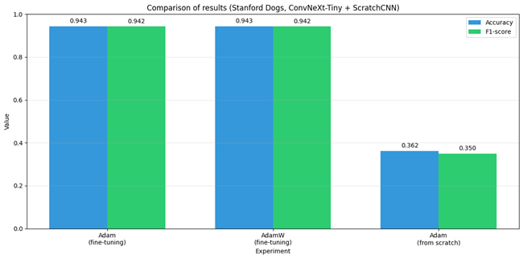

# Лабораторная работа №1 -- Классификация пород собак с помощью ConvNeXt-Tiny

**Выполнил студент группы 459м** Смирнов Роман Константинович

Использовался датасет Stanford Dogs, архитектура ConvNeXt-Tiny и фреймворк PyTorch + torchvision.

## Ход работы

Была обучена нейронная сеть распознавать породу собаки по фотографии. Для этого задействован датасет с 120 породами и 20580 изображений. По варианту использовалась архитектура ConvNeXt-Tiny.

Проведены три эксперимента:
1. Дообучение предобученной модели с оптимизатором Adam
2. Дообучение предобученной модели с оптимизатором AdamW (согласно варианту)
3. Обучение модели с нуля (случайная инициализация) с оптимизатором Adam

Аугментация данных не применялась в соответствии с вариантом задания.

## Теория

### ConvNeXt-Tiny

ConvNeXt — это семейство архитектур, которое модернизирует классические сверточные сети, приближая их по эффективности к трансформерам, но сохраняя присущую CNN эффективность. ConvNeXt-Tiny использует следующие инновации:

- **Увеличенный размер ядра** (kernel size 7x7 вместо 3x3) для расширения рецептивного поля.
- **Раздельные слои** (depthwise convolution) для снижения вычислительной сложности.
- **Инвертированные узкие места** (inverted bottleneck) как в трансформерах: расширение каналов в MLP-подобных блоках.
- **Нормализация LayerNorm** вместо BatchNorm для стабильности обучения.

ConvNeXt-Tiny имеет около 28 миллионов параметров, что делает его легче ViT-B/16 (86M), но при этом он достигает сравнимой точности. Ключевое преимущество — сверточная природа сети дает индуктивные предпосылки (локальность и трансляционная инвариантность), благодаря чему модель может обучаться эффективнее на датасетах ограниченного размера.

### Transfer learning (дообучение)

В экспериментах 1 и 2 использовалась модель, предобученная на ImageNet (1.2 млн изображений, 1000 классов). Последний классификационный слой заменен на новый с 120 выходами, соответствующими породам собак. Backbone модели был заморожен — обучались только параметры нового классификатора. 

### Оптимизаторы

Согласно варианту, проведено обучение с двумя оптимизаторами: Adam и AdamW.

**Adam** (Adaptive Moment Estimation) — оптимизатор, который комбинирует идеи Momentum и RMSProp. Он хранит скользящие средние градиентов (первый момент) и квадратов градиентов (второй момент), что позволяет адаптировать скорость обучения для каждого параметра. Использованы параметры: lr=1e-3, weight_decay=1e-4.

**AdamW** — модификация Adam, которая исправляет проблему взаимодействия L2-регуляризации и адаптивного обучения. В стандартном Adam weight_decay применяется внутри обновления моментов, что приводит к субоптимальной регуляризации. AdamW выносит weight_decay за пределы этого процесса, применяя его непосредственно к весам после основного обновления. Использованы параметры: lr=1e-3, weight_decay=1e-2 (более сильная регуляризация, чем у Adam).

## Структура проекта

Lab_work1/
├── models/
│ ├── init.py
│ └── convnext.py # Архитектура ConvNeXt-Tiny
├── utils/
│ ├── init.py
│ ├── dataset.py # Загрузка данных, разбиение 70/15/15
│ ├── train.py # Функции обучения и оценки
│ └── result_plots.py # Визуализация результатов
├── results/ # Сохраняются графики и веса моделей
├── main.py # Запуск всех экспериментов
├── requirements.txt # Зависимости
├── .gitignore
└── README.md


## Разбиение данных

Датасет разбит на три части:

| Часть | Доля | Изображений |
|-------|------|-------------|
| Train | 70%  | ~14 406     |
| Val   | 15%  | ~3 087      |
| Test  | 15%  | ~3 087      |

Seed зафиксирован на 497328, разбиение воспроизводимо. Аугментация данных не применялась (только ресайз до 224x224 и нормализация).

## Результаты

### Тестовые метрики

| Эксперимент | Accuracy | Precision | Recall | F1-score |
|-------------|----------|-----------|--------|----------|
| **Pretrained + Adam** | **94.59%** | **94.68%** | **94.59%** | **94.53%** |
| Pretrained + AdamW | 94.27% | 94.62% | 94.27% | 94.23% |
| From Scratch + Adam | 4.60% | 3.75% | 4.60% | 3.00% |

**Дообучение с Adam показало лучшие результаты по всем метрикам.** AdamW отстает незначительно (около 0.3%), что может объясняться более сильной регуляризацией (weight_decay=1e-2 против 1e-4 у Adam). Для данного датасета сильная регуляризация оказалась избыточной.

Обучение с нуля за 10 эпох не дало осмысленного результата — accuracy на уровне случайного угадывания (1/120 ≈ 0.83%). ConvNeXt, как и любая глубокая сеть, требует предобучения на больших датасетах (ImageNet) для выучивания базовых визуальных признаков.



### Adam vs AdamW

При одинаковых условиях (предобученный ConvNeXt-Tiny, замороженный backbone, 10 эпох):

| Метрика | Adam | AdamW | Разница |
|---------|------|-------|---------|
| Accuracy | 94.59% | 94.27% | +0.32% |
| Precision | 94.68% | 94.62% | +0.06% |
| Recall | 94.59% | 94.27% | +0.32% |
| F1 | 94.53% | 94.23% | +0.30% |

Adam показывает стабильно более высокие метрики, хотя разница не является значительной. AdamW с более высоким weight_decay (1e-2) сильнее регуляризует модель, что в данном случае слегка ухудшает качество.

### Сходимость

Оба варианта дообучения сходились быстро:
- **Adam**: уже на 1-й эпохе val accuracy достигла 93.23%, к 6-й эпохе — 94.30%
- **AdamW**: на 1-й эпохе 93.26%, пик на 3-й эпохе — 94.10%

Обучение с нуля: val accuracy колебалась в районе 2-5% все 10 эпох, что подтверждает бесполезность обучения без предобучения на данном размере датасета.

### Основные выводы

1. **Дообучение на предобученной ConvNeXt-Tiny дает высокое качество (94.6%)** при минимальных вычислительных затратах (10 эпох, ~15 минут на T4).
2. **Adam показал результат не хуже AdamW** (даже слегка лучше). AdamW с сильной регуляризацией оказался избыточным для этой задачи.
3. **Обучение с нуля не имеет смысла** — модель не выучивает осмысленные признаки за разумное число эпох. ConvNeXt, как и любая глубокая CNN, требует предобучения на ImageNet.
4. **Отсутствие аугментации не помешало дообучению** — предобученная модель уже обладает робастными признаками.

## Воспроизведение
Обучение проводилось на Google Colab (GPU T4). Для повторения:

```bash
# Установка зависимостей
pip install -r requirements.txt

# Запуск всех экспериментов
python main.py

Перед запуском необходимо установить Kaggle API ключи в файле utils/dataset.py или через переменные окружения.
