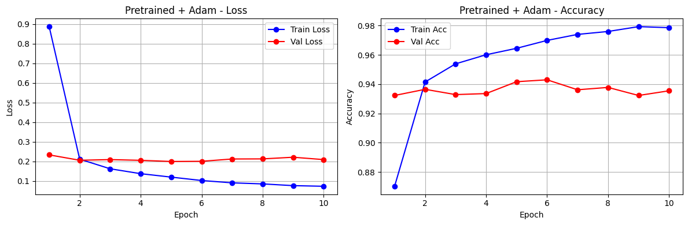
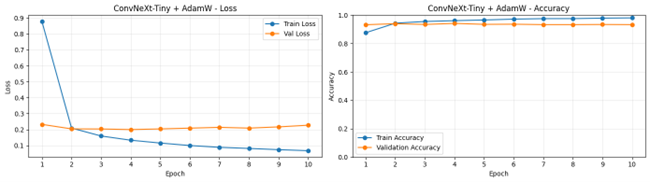
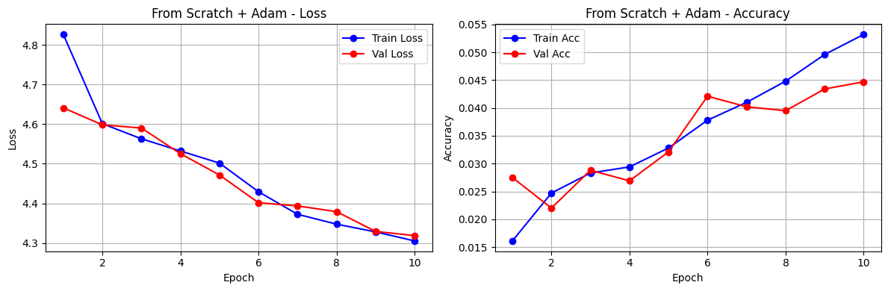
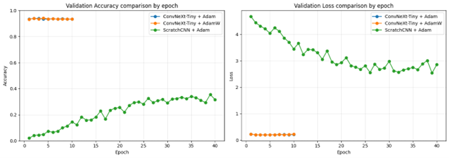

# Лабораторная работа №1 - Классификация пород собак с помощью ConvNeXt-Tiny

**Выполнил студент группы 459м** Смирнов Роман Константинович (Вариант №8)

Использовался датасет Stanford Dogs, архитектура ConvNeXt-Tiny и фреймворк PyTorch + torchvision.

## Ход работы

Была обучена нейронная сеть для распознавания породы собаки по фотографии.
Для этого использовался датасет Stanford Dogs с 120 породами и 20580 изображениями.
По варианту использовалась архитектура ConvNeXt-Tiny.

Проведены три эксперимента:

1. Дообучение предобученной ConvNeXt-Tiny с оптимизатором Adam.
2. Дообучение предобученной ConvNeXt-Tiny с оптимизатором AdamW.
3. Обучение собственной модели ScratchCNN с нуля с оптимизатором Adam.

Для обучающей выборки использовался `RandomHorizontalFlip(p=0.5)`, а для validation/test применялись только Resize, ToTensor и Normalize. В варианте не была задана специальная аугментация, поэтому использовалась только базовая горизонтальная инверсия для повышения устойчивости модели.

## Теория

### ConvNeXt-Tiny

ConvNeXt - это семейство архитектур, которое модернизирует классические сверточные сети, приближая их по эффективности к трансформерам, но сохраняя присущую CNN эффективность. ConvNeXt-Tiny использует следующие идеи:

- **Увеличенный размер ядра** для расширения рецептивного поля.
- **Разделимые сверточные слои** для снижения вычислительной сложности.
- **Инвертированные bottleneck-блоки** с расширением каналов внутри блока.
- **LayerNorm** вместо BatchNorm для более стабильного обучения.

ConvNeXt-Tiny имеет около 28 миллионов параметров. Ключевое преимущество архитектуры - сверточная природа сети, которая задает полезные индуктивные предпосылки: локальность и трансляционную инвариантность. Благодаря этому модель эффективно работает с изображениями и хорошо подходит для transfer learning.

### ScratchCNN

ScratchCNN - собственная сверточная нейронная сеть, реализованная вручную через `nn.Module`. Она не является готовой моделью из `torchvision` и не использует предобученные веса.

Архитектура ScratchCNN состоит из пяти сверточных блоков:

```text
Conv2d -> BatchNorm2d -> ReLU -> MaxPool2d
```

В каждом следующем блоке увеличивается число каналов:

```text
3 -> 32 -> 64 -> 128 -> 256 -> 512
```

После сверточной части применяется `AdaptiveAvgPool2d((1, 1))`, который преобразует карты признаков в компактный вектор. Затем используется полносвязный классификатор:

```text
Flatten -> Dropout -> Linear(512, 256) -> ReLU -> Dropout -> Linear(256, 120)
```

Такая модель обучается с нуля: все веса инициализируются случайно и обновляются в процессе обучения на Stanford Dogs.

### Transfer learning

В экспериментах 1 и 2 использовалась модель ConvNeXt-Tiny, предобученная на ImageNet. Последний классификационный слой был заменен на новый слой со 120 выходами, соответствующими породам собак.

Backbone модели был заморожен, поэтому обучались только параметры нового классификатора. Такой подход позволяет использовать признаки, уже выученные моделью на большом датасете, и быстро адаптировать модель под новую задачу.

### Оптимизаторы

Согласно варианту, проведено обучение с двумя оптимизаторами: Adam и AdamW.

**Adam** (Adaptive Moment Estimation) - оптимизатор, который комбинирует идеи Momentum и RMSProp. Он хранит скользящие средние градиентов и квадратов градиентов, что позволяет адаптировать скорость обучения для каждого параметра. Использованные параметры: `lr=1e-3`, `weight_decay=1e-4`.

**AdamW** - модификация Adam, которая отделяет weight decay от основного обновления параметров. Это делает регуляризацию более корректной для адаптивных оптимизаторов. Использованные параметры: `lr=1e-3`, `weight_decay=1e-2`.

## Разбиение данных

Датасет разбит на три части:

| Часть | Доля | Изображений |
|---|---:|---:|
| Train | 70% | ~14 406 |
| Val | 15% | ~3 087 |
| Test | 15% | ~3 087 |

Seed зафиксирован на `497328`, поэтому разбиение воспроизводимо.

## Результаты

### Тестовые метрики

| Эксперимент | Accuracy | Precision | Recall | F1-score |
|---|---:|---:|---:|---:|
| Pretrained + Adam | 94.27% | 94.43% | 94.27% | 94.23% |
| Pretrained + AdamW | 94.30% | 94.63% | 94.30% | 94.24% |
| ScratchCNN + Adam | 36.17% | 38.22% | 36.17% | 34.96% |

AdamW в текущем запуске немного превосходит Adam по всем тестовым метрикам, однако разница очень мала, поэтому результаты двух оптимизаторов можно считать сопоставимыми.










### Сравнение Adam и AdamW

| Метрика | Adam | AdamW | Разница |
|---|---:|---:|---:|
| Accuracy | 94.27% | 94.30% | AdamW лучше на 0.03% |
| Precision | 94.43% | 94.63% | AdamW лучше на 0.20% |
| Recall | 94.27% | 94.30% | AdamW лучше на 0.03% |
| F1-score | 94.23% | 94.24% | AdamW лучше на 0.01% |

AdamW незначительно превосходит Adam по всем метрикам, но разница меньше 0.3%, поэтому существенного преимущества одного оптимизатора над другим не наблюдается.

### Сходимость

- **ConvNeXt-Tiny + Adam**: `val_acc = 93.46%` на 1-й эпохе -> лучший `val_acc = 93.94%` на 3-й эпохе. После 3-й эпохи качество колебалось около 93.3-93.7%.
- **ConvNeXt-Tiny + AdamW**: `val_acc = 93.23%` на 1-й эпохе -> лучший `val_acc = 94.17%` на 4-й эпохе. После 4-й эпохи качество также колебалось около 93.3-93.6%.
- **ScratchCNN + Adam**: `val_acc = 2.04%` на 1-й эпохе -> лучший `val_acc = 35.54%` на 39-й эпохе. На 40-й эпохе `val_acc = 31.65%`, то есть присутствуют колебания, но общий рост качества заметный.

Предобученные модели сходятся быстро, потому что используют признаки, заранее выученные на ImageNet. ScratchCNN обучается медленнее, так как все признаки извлекаются с нуля.

## Выводы

Дообучение предобученной ConvNeXt-Tiny обеспечивает наилучшее качество: около 94.3% accuracy на тестовой выборке.

Adam и AdamW показали практически одинаковые результаты. В текущем запуске AdamW немного лучше Adam, но разница меньше 0.3%, поэтому существенного преимущества одного оптимизатора над другим не наблюдается.

Собственная ScratchCNN, обученная с нуля, показала 36.17% accuracy и 34.96% F1-score на тестовой выборке. Это значительно хуже предобученной ConvNeXt-Tiny, но намного выше случайного угадывания для 120 классов, которое составляет примерно 0.83%.

Обучение модели с нуля требует большего числа эпох и хуже обобщается, так как модель самостоятельно учит все признаки изображений без предобучения на крупном датасете.

Базовая горизонтальная аугментация помогла увеличить разнообразие обучающей выборки, однако основной вклад в высокое качество первых двух экспериментов внесло именно предобучение ConvNeXt-Tiny на ImageNet.

## Воспроизведение

Обучение проводилось на Google Colab с GPU T4. Для повторения экспериментов:

```bash
# Установка зависимостей
pip install -r requirements.txt

# Запуск всех экспериментов
python main.py
```

Перед запуском необходимо установить Kaggle API ключи в файле `utils/dataset.py` или через переменные окружения.

## Использованные источники

1. Stanford Dogs Dataset: http://vision.stanford.edu/aditya86/ImageNetDogs/
2. PyTorch documentation: https://pytorch.org/docs/stable/index.html
3. Torchvision models documentation: https://pytorch.org/vision/stable/models.html
4. ConvNeXt paper: https://arxiv.org/abs/2201.03545
5. AdamW paper: https://arxiv.org/abs/1711.05101
